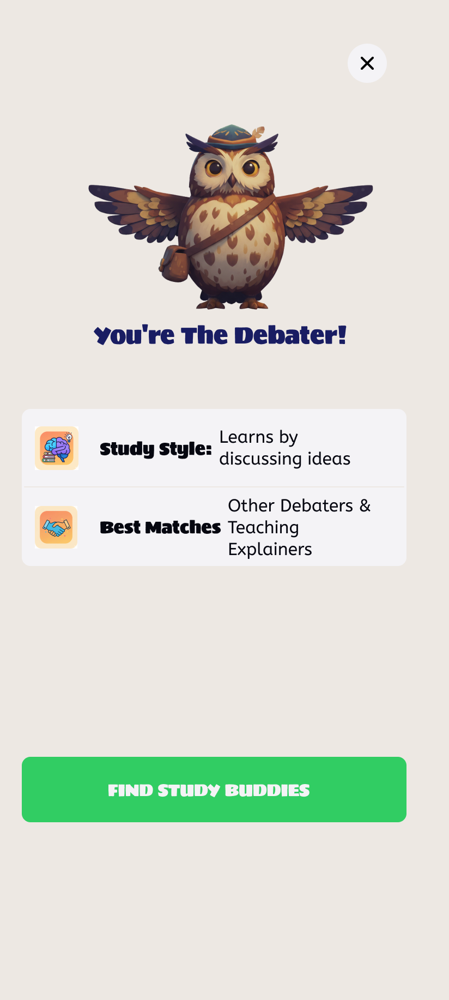
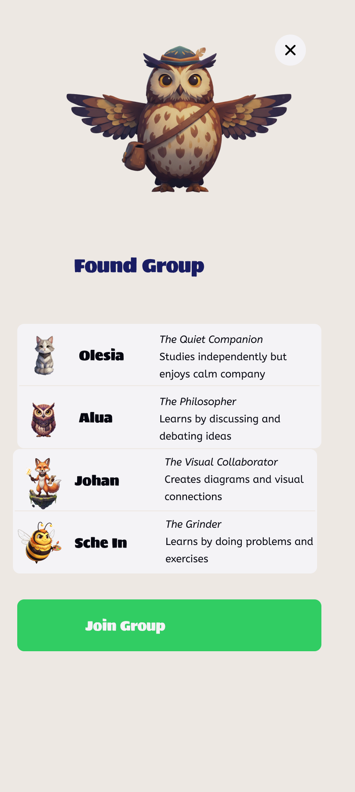

# Studygram DPM 3 Report
Gamify Labs: Alua Kaliazhdarova, Olesia Bilyk, Johan Ronnquist, Sche In Baek
## Problem Statement
University students miss out on collaborative study opportunities in classes due to feeling uncomfortable approaching classmates and continuing to engage with them throughout the semester, leading to isolated learning and lower academic performance.

## Tasks
1. Take a quiz when entering the app for the first time, find out your learning type and get matched with other students based on it. 
    - **User perspective:** “I want to discover my learning style and get matched with compatible classmates while receiving a personalized study companion"
    - **Task description:** When first entering the app, users take a brief compatibility quiz about their study goals, pace, schedule, and learning preferences. Based on their responses, they're assigned a learning type and a corresponding virtual pet (owl, bee, dolphin, fox, or cat). The system then matches them with a study group within their class that has compatible study patterns and overlapping availability. This eliminates the anxiety of cold-approaching random classmates by providing pre-vetted, compatible study partners.
    - **Why this solves the problem:** Removes the social barrier of initiating contact by using algorithmic matching instead of requiring students to approach strangers. The quiz provides a structured, low-pressure way to share preferences, and receiving a pet immediately creates a playful first experience that reduces anxiety about joining a group
1. Create a flashcard set or add cards to already existing sets created by your group; receive a publically visible reward and possibly an accessory for your avatar. 
    - **Task description:** Users create flashcard sets or add cards to existing sets shared within their study group. They can choose between multiple-choice questions or definition-based cards. As they contribute, they earn points that grow their virtual pet, making their effort visible to groupmates. This builds credibility and rapport asynchronously, allowing shy students to demonstrate value before face-to-face interaction.
    - **User perspective:** "I contribute to my study group and the community by sharing study tools that I’ve made, and earn visible rewards that motivate me even further to keep contributing.”
    - **Why this solves the problem:** Allows students to demonstrate value and build credibility through study contributions before having to perform socially. The asynchronous nature reduces pressure.

1. Test yourself with a set of cards and upvote or downvote cards along the way
    - **User perspective:** “I use the cards made by my groupmates and other classmates to learn and test my knowledge. I can check whether the card set is good based on the upvotes and downvotes, or evaluate them myself.”
    - **Task description:** Users browse flashcard sets created by their group members and test themselves. While studying, they can upvote helpful cards or downvote confusing ones, helping the group curate high-quality study materials. Studying also earns contribution points, rewarding both creation and active learning.
    - **Why this solves the problem:** Enables participation without requiring real-time social interaction; voting system gives everyone input on quality without having to speak up in person; shared learning activity creates common ground before face-to-face meetings.
1. See the log of your group's joint study sessions and create a new one in ~one click; the rest of the group can hop on
    - **User perspective:** “I can see the progress we have made as a group in studying, which feels rewarding itself. If I want, I may start a new session anytime, and if my groupmates are available, they can join me at their own time.”
    - **Task description:** Users can view a chronological log of their group's past study sessions showing when they met, who attended, and what they studied. When they want to start a new session, they click "Create Session" which sends a notification to all group members. Groupmates can join the session at their convenience through the notification or by checking the group's active sessions page. The session tracks participation time and awards contribution points to all attendees.
    - **Why this solves the problem:** It makes collaboration effortless and natural, as the app notifies the groupmates, the user doesn’t have to initiate conversations and planning themselves.

## Prototype
#### Link
Our prototype is available here: [Figma prototype](https://www.figma.com/design/umK9e0xpKP2qjlNV1JeIfc/Studygram?node-id=0-1&m=dev). It is a dev link, please enter the presentation mode for Start flowx to view it.
#### Summary
This tool is designed to help students find social learning opportunities within a class. Those opportunities range from being matched to a group according to your learning type quiz result to receiving feedback from other students about the flashcards you created. Logically, the user can also submit feedback about others' cards and simply use them for studying (which is not social on its own but is facilitated by shared resources available to all students instead of isolating "every man for themselves" approach). The flashcards smoothen interactions with the entire class and possibly the whole university, while our last feature, group study sessions, provides a way to bond with the group one is assigned to and as a bonus gain more access to other study resources (for instance, by receiving coins for a completed session that flashcard sets can be purchased with). 
#### Design Choices
- Gamified elements such as walking around and approaching others with your avatar pet due to Figma's limitations of prototyping continuous movement
- Typing is not implemented and instead hard-coded into the prototype
- Only the quiz is implemented among all Sign Up steps since the rest is irrelevant to our chosen problem's solution
- Consequences of others down- or upvoting one's cards are not displayed, though it will be reflected in coin count or similar stats
- Return button is not working on each Figma frame since the purpose is to create a convenient flow of exploring our tool's features, not show all the transitions possible
- We did not add the learning streak and other accomplishments' reflection in the pet/avatar's appearance that is supposed to contribute to the user's experience as a social recognition opportunity. This is due to other tasks implemented having more direct social interactions and limitations of Figma simulation for progression of a pet's lifetime
- Coin count is not reflected correctly in all the transitions to enable loops in the prototype
- Low-fi prototype of group study session reflects the general flow of the process and does not address edge cases such as users attempting to game the system
- Profile settings are not simulated because they are not core to our solution
#### Representative screenshots
   

#### Instructions

## Observations from User-testing
#### Participants
Participant 1 (P1) - Jana
- 21-year-old Industrial Design undergraduate student
- igh tech proficiency with Apple ecosystem; heavy social media user
- Uses ChatGPT, Google Docs, and Apple Notes for studying
- Has used Quizlet but doesn't create own flashcards
- Prefers studying alone for difficult material, with friends for simpler tasks
- Frequently works on group projects with discussion-based study sessions 

Participant 2 (P2) - Sebastian
- 21-year-old Business Computer Science undergraduate exchange student
- Never used flashcards for studying
- Has to study alone because he is an exchange student at KAIST

Participant 3 (P3) - Insar
- 20-year-old Chemical Biomolecular engineering undergraduate student
- Social media user
- Uses ChatGPT, Notion, and Zoom for studying
- Has used Anki but doesn't create flashcards
- Prefers studying with friends for difficult material, alone for simpler tasks
- Frequently works on independent group projects 

#### Usability Problems Discovered
ONBOARDING & QUIZ FLOW
1. Insufficient first-time user guidance [HIGH]
    - Users received no introduction or contextual help when first using the app (P1)
    - P1 requested "more introduction from the beginning to ease in the user"
    - Plan: Create a 3-4 screen tutorial flow on first launch highlighting key features, with skip option
2. Quiz options too restrictive [LOW]
    - Multiple-choice format forced users to select one option when multiple may apply (P2)
    - P2 noted "some people like all the options but you can only choose one"
    - Plan: Allow multiple selections where appropriate or add "It depends" options
2. Can’t go back in the quiz [HIGH]
    - Users can’t go back to the question in case they want to change their answer. (P3)
    - P3 said "I understood the question wrong, but now I can’t change my answer, it might assign me the wrong learning type"
    - Plan: Add a back button

NAVIGATION & INFORMATION ARCHITECTURE
3. Back button returns to start instead of previous screen [HIGH]
    - Back navigation takes users to the beginning rather than one step backward (P1/P3)
    - P1 stated "go back is taking back to the start and not just one step back"
    - Plan: Implement proper navigation history stack so back returns to immediately previous screen
4. Home and social screens visually too similar [MEDIUM]
    - Visual similarity between screens caused confusion about location and available actions (P1)
    - P1 said screens "should be more different" as she expected same buttons but found different ones
    - Plan: Differentiate screens through distinct color schemes, headers, or layouts
5. Cannot review questions while creating answer cards [MEDIUM]
    - Users cannot see the question while typing the answer (P2)
    - P2 said "I couldn't go back and see the question"
    - Plan: Implement split-screen or collapsible view keeping question visible during answer entry
6. No contextual help system available [MEDIUM]
    - No tooltips or info icons to provide clarification when needed (P1/P2)
    - P2 suggested "some popups should show when you hold over things for more info"
    - Plan: Add info icons next to complex features with tap/hold explanations for mobile
7. Settings button lacks visibility [LOW]
    - Settings button blends into background and is difficult to notice (P3)
    - Plan: Increase contrast or use outlined icon style; consider relocating to standard position

STUDY CARD CREATION
8. Card types not clearly differentiated [HIGH]
    - Users don't understand differences between Title, Studygram, and Question card types (P1)
    - When asked if she understood card types, P1 answered "she didn't"
    - Plan: Add descriptive subtitles under each type: "Title: Headers & dividers", "Studygram: Visual notes", "Question: Q&A flashcards"
9. "Set" terminology completely unclear [MEDIUM]
    - Users confused about what "set" means - course, collection, or something else (P1)
    - P1 asked "Add it to set what set? Do you mean the course? If I am already in social computing group then what's the point of adding it to a set"
    - Plan: Replace "set" with clearer term like "Course" or "Subject" and add contextual explanation
10. Color picker offers too many options [LOW]
- Excessive color choices are overwhelming and unnecessary (P2)
- Plan: Reduce to 8-12 curated colors with optional custom color for advanced users

GROUP STUDY SESSIONS
11. Timer purpose completely unclear [HIGH]
- Users don't understand what the study session timer is for or when to use it (P1)
- P1 asked "why set the timer? To see how long people contribute?"
- Plan: Add tooltip: "Start timer when group begins studying to track session and earn coins together"
12. Study session value proposition unclear [MEDIUM]
- Users questioned the overall purpose and benefit of creating sessions (P3)
- P3 asked "didn't make sense what is the point"
- Plan: Add benefit-focused copy explaining sessions and show examples of successful sessions

VISUAL DESIGN
13. Excessive color usage reduces clarity [LOW]
- Too many different colors used, reducing visual hierarchy (P1)
- P1 advised "Be mindful of colours. Minimize the colours or use different shades of green"
- Plan: Establish disciplined color system with 1 primary color, 1-2 accents, and neutral grays

Testing with P1, P2, and P3 revealed that while the core concept resonated ("would use it if there is someone actually helpful there"), the app suffers from unclear terminology, insufficient onboarding, and missing contextual guidance. The most critical issues to address are: (1) adding first-time user onboarding, (2) fixing back navigation, (3) clarifying card types and "set" terminology, and (4) explaining the timer purpose. P1 appreciated the quiz concept and basic navigation but noted "it took time to learn how to use it... just some functions not clear."
