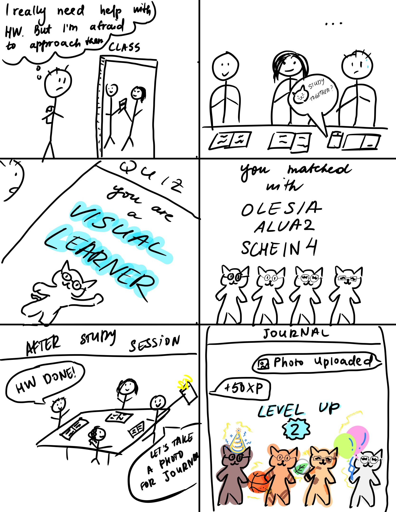
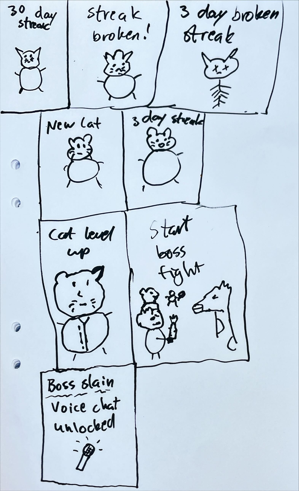
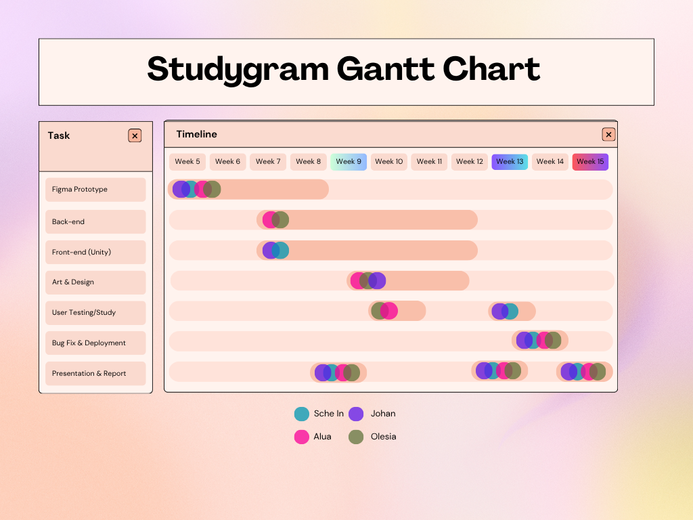

# Studygram DPM 2 Report
Gamify Labs: Alua Kaliazhdarova, Olesia Bilyk, Johan Ronnquist, Sche In Baek
## Problem Statement
University students struggle to connect with their peers in class due to shyness, missing social learning opportunities.

## Solution
Studygram is a class-scoped gamified social learning platform that targets initiation awkwardness, the hesitation before contacting or joining classmates. Students take a short study-style quiz to get compatible group suggestions with built-in icebreaker prompts. Joining is one-click into low-pressure rooms with different activities like Pomodoro session, Q & A, chatroom. Group activity contributions earn virtual pet boosters that can be traded for pet level up and customization, so users can look at each other’s pets to compare their progress, motivating users to study together. These level ups unlock perks like flashcards and badges, which provides external incentive and social recognition. Studygram transforms awkward first meets into a playful, low-pressure experience.

## Core tasks
- Take a quick quiz (goals, pace, schedule, study style) → receive 3–5 group suggestions with overlapping times to help people find study groups/partners within a class.
- Share notes, answer questions, post mini-summaries, create Anki Cards to share them directly / Communicate with classmates → Users will be able to communicate with their classmates through sharing study materials, discussion boards.
- One-click group study session creation where groups have the option to meet IRL or online→ post-session journal log window to submit a list of participants and photos of notes (available for reporting offline sessions as well); pop-up if there was no participation for a while. 
- Award people for their contribution to the community→ earn points that unlock group items and credits to customize the Pet. A user starts with a pet whose looks correspond to their results on a “learner type” quiz; after that, with a certain number of contribution points, the pet grows up.
## Competitive Analysis
|  App Name        |  Peer Matching  |  Virtual Pet  |  Professor/TA Reliant  | Team communication |  Reward system  |  Study-focused  |
|------------------|-----------------|---------------|------------------------|--------------|-----------------|-----------------|
| FocusMate        | O               | X             | X                      |  O           | X               | O               |
| CLASSUM          | X               | X             | O                      | O            | ~               | O               |
| Yeolpumta (YPT)  | ~               | X             | X                      | O            | X               | O               |
| Studygram        | O               | O             | X                      | O            | O               | O               | 
|                  |                 |               |  | | ||

~ - somewhat applicable

1. **FocusMate:** A video coworking platform that pairs strangers for 25-50 minute accountability sessions. While it eliminates the need to find partners, the random global matching means partners aren't in the same class and can't help with specific coursework. The mandatory video also increases pressure for shy students.
6. **CLASSUM:** a communication centered learning platform, which includes multiple shared boards, divided by topics. It allows people to post questions and other members of the space to react or answer that question. Classum heavily relies on professors and TAs, while we focus on unguided communication between classmates, which can be counted as an advantage. Our system also includes some gamified elements like a virtual pet, which is not present in Classum. The main advantage is that our app creates a platform specifically for group studies, rather than just asking questions on the board.
8. **열정 품은 타이머/ YPT - Yeolpumta:** You can inspire others to study more effectively by measuring and sharing your study time. Join a study group to study with others and share information. You can join an online study group and compete with other group members for study time. To invite someone to a group, simply generate an invitation link and share it with them. However, in YPT you have to ask people if they want to join a group, so it doesn’t solve the problem of people being shy and engaging in social learning groups. Here users are only compared by the studying time, while our app can motivate users to study together. 

## Timeline and Responsibilities
